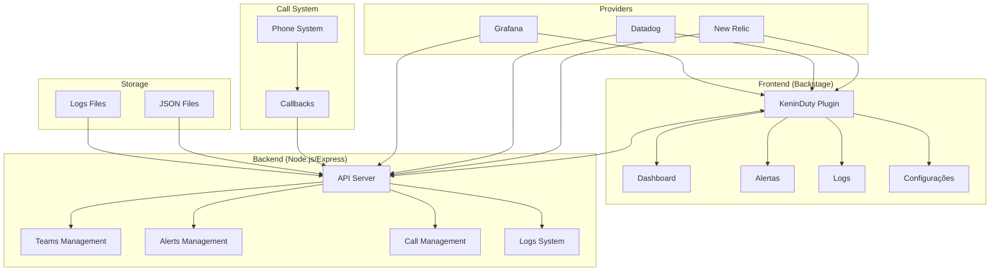
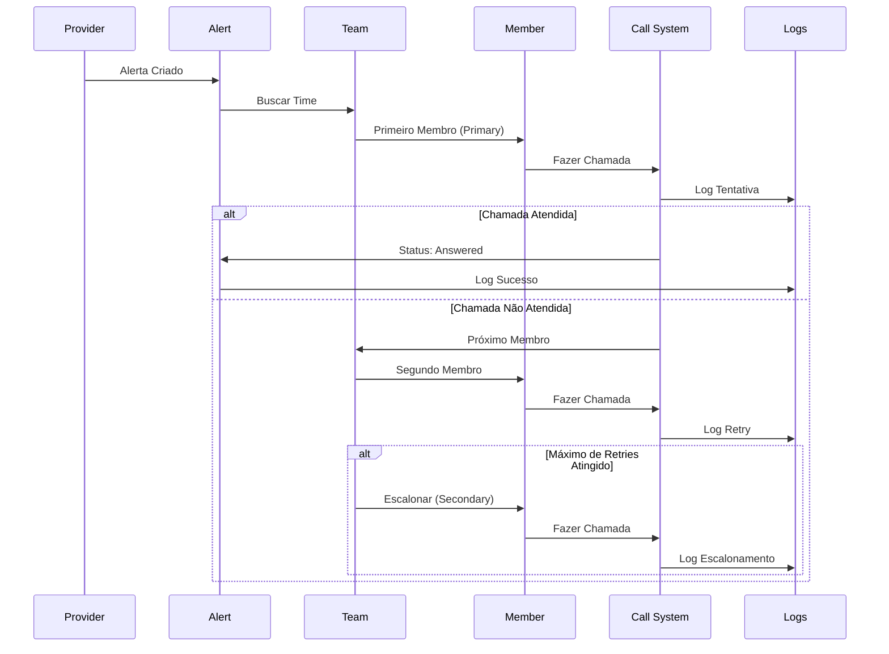

# 🚀 KeninDuty - Sistema de Gerenciamento de On-Call e Alertas

[](https://backstage.io)
[](LICENSE)
[](https://nodejs.org)

> **Sistema completo de gerenciamento de on-call com integração a providers de monitoramento, escalonamento inteligente e interface moderna.**

## 📋 Índice

- [🎯 Visão Geral](#-visão-geral)
- [🏗️ Arquitetura](#️-arquitetura)
- [✨ Funcionalidades](#-funcionalidades)
- [🚀 Instalação](#-instalação)
- [⚙️ Configuração](#️-configuração)
- [🎮 Como Usar](#-como-usar)
- [📊 API Reference](#-api-reference)
- [🔧 Desenvolvimento](#-desenvolvimento)
- [🤝 Contribuição](#-contribuição)

---

## 🎯 Visão Geral

O **KeninDuty** é um plugin completo para Backstage que oferece um sistema de gerenciamento de on-call profissional, integrando-se com providers de monitoramento populares (New Relic, Datadog, Grafana) e fornecendo escalonamento inteligente de alertas.

### 🎯 Principais Benefícios

- ✅ **Integração Multi-Provider**: New Relic, Datadog, Grafana
- ✅ **Escalonamento Inteligente**: Retry automático e escalonamento por membros
- ✅ **Interface Moderna**: Dashboard em tempo real com Material-UI
- ✅ **Logs Persistentes**: Histórico completo de todas as ações
- ✅ **Gestão de Times**: Criação e gerenciamento de equipes on-call
- ✅ **Callbacks em Tempo Real**: Status de chamadas atualizado instantaneamente

---

## 🏗️ Arquitetura



### 🔄 Fluxo de Escalonamento



---

## ✨ Funcionalidades

### 📊 Dashboard
- **Métricas em Tempo Real**: Alertas ativos, times, membros, tentativas
- **Atividade Recente**: Últimos eventos do sistema
- **Gráficos Interativos**: Visualização de dados

### 🚨 Gestão de Alertas
- **Cards Visuais**: Interface moderna com Material-UI
- **Paginação**: Navegação eficiente por alertas
- **Filtros Avançados**: Por status, severidade, provider
- **Histórico Detalhado**: Tentativas de chamada e escalonamentos
- **Ações Rápidas**: Reconhecer, resolver, retry

### 👥 Gestão de Times
- **Criação de Times**: Interface intuitiva
- **Membros**: Primary, Secondary, Escalation
- **Política de Escalonamento**: Configurável por time
- **Paginação**: Gerenciamento eficiente

### 📞 Sistema de Chamadas
- **Retry Automático**: Configurável por time
- **Escalonamento Inteligente**: Próximo membro automaticamente
- **Callbacks**: Status em tempo real
- **Logs Detalhados**: Histórico completo

### 📋 Logs e Auditoria
- **Logs Persistentes**: Salvos em arquivo JSON
- **Filtros Avançados**: Por nível, categoria, callId
- **Busca em Tempo Real**: Pesquisa instantânea
- **Auto-refresh**: Atualização automática

---

## 🚀 Instalação

### Pré-requisitos

- **Node.js** 18+ 
- **Backstage** instalado e configurado
- **Git** para clonar o repositório

### Passo 1: Clonar o Plugin

```bash
# Navegar para o diretório de plugins do Backstage
cd your-backstage-app/plugins

# Clonar o plugin
git clone https://github.com/seu-usuario/watchful-kenin-portal.git

# Entrar no diretório
cd watchful-kenin-portal
```

### Passo 2: Instalar Dependências

```bash
# Instalar dependências do plugin
npm install

# Ou usando yarn
yarn install
```

### Passo 3: Configurar Backstage

Adicione o plugin ao seu `app-config.yaml`:

```yaml
# app-config.yaml
plugins:
  - watchful-kenin-portal
```

### Passo 4: Registrar o Plugin

No arquivo `packages/app/src/App.tsx`:

```tsx
import { KeninDutyPage } from '@backstage/plugin-watchful-kenin-portal';

// Adicionar à lista de rotas
<Route path="/kenin-duty" element={<KeninDutyPage />} />
```

---

## ⚙️ Configuração

### 1. Configuração do Backend

Crie um arquivo `.env` na raiz do plugin:

```bash
# .env
KENINDUTY_PORT=7007
NODE_ENV=development
```

### 2. Configuração dos Providers

#### New Relic
```yaml
# app-config.yaml
integrations:
  newrelic:
    - apiKey: ${NEWRELIC_API_KEY}
      accountId: ${NEWRELIC_ACCOUNT_ID}
```

#### Datadog
```yaml
# app-config.yaml
integrations:
  datadog:
    - apiKey: ${DATADOG_API_KEY}
      appKey: ${DATADOG_APP_KEY}
```

#### Grafana
```yaml
# app-config.yaml
integrations:
  grafana:
    - url: ${GRAFANA_URL}
      token: ${GRAFANA_TOKEN}
```

### 3. Configuração do Sistema de Chamadas

Configure o sistema de chamadas (Twilio, etc.) para enviar callbacks para:

```
POST http://localhost:7007/api/keninduty/callback/call-status
```

---

## 🎮 Como Usar

### 1. Iniciar os Servidores

#### Terminal 1 - Backend
```bash
cd plugins/watchful-kenin-portal
npm run start:api
```

#### Terminal 2 - Frontend (Backstage)
```bash
# Na raiz do seu projeto Backstage
yarn start
```

### 2. Acessar o Plugin

Abra seu navegador e acesse:
```
http://localhost:3000/kenin-duty
```

### 3. Criar Primeiro Time

1. **Vá para a aba "Alertas"**
2. **Clique em "Criar Time"**
3. **Preencha os dados**:
   - Nome do time
   - Membros (nome, telefone, email, role)
   - Política de escalonamento

### 4. Configurar Providers

1. **Vá para "Configurações"**
2. **Adicione suas credenciais** dos providers
3. **Configure os webhooks** nos providers para apontar para o KeninDuty

### 5. Testar o Sistema

1. **Crie um alerta de teste**
2. **Configure o team ID** no provider
3. **Simule uma chamada** usando os endpoints da API

---

## 📊 API Reference

### Endpoints Principais

#### Health Check
```bash
GET /health
```

#### Teams
```bash
GET    /api/keninduty/teams
POST   /api/keninduty/teams
PUT    /api/keninduty/teams/:id
DELETE /api/keninduty/teams/:id
```

#### Alerts
```bash
GET    /api/keninduty/alerts
POST   /api/keninduty/providers/:provider/alerts
PATCH  /api/keninduty/alerts/:id
```

#### Calls
```bash
POST   /api/keninduty/calls/init
POST   /api/keninduty/callback/call-status
```

#### Logs
```bash
GET /api/keninduty/logs/realtime
```

#### Stats
```bash
GET /api/keninduty/stats
```

### Exemplos de Uso

#### Criar Time
```bash
curl -X POST http://localhost:7007/api/keninduty/teams \
  -H "Content-Type: application/json" \
  -d '{
    "name": "Time DevOps",
    "members": [
      {
        "name": "João Silva",
        "phone": "+5511999999999",
        "email": "joao@empresa.com",
        "role": "primary"
      }
    ],
    "escalationPolicy": {
      "retryCount": 3,
      "retryIntervalMinutes": 5,
      "escalationDelayMinutes": 15
    }
  }'
```

#### Inicializar Chamada
```bash
curl -X POST http://localhost:7007/api/keninduty/calls/init \
  -H "Content-Type: application/json" \
  -d '{
    "callId": "call-123",
    "teamId": "team-456",
    "alertId": "alert-789"
  }'
```

#### Callback de Status
```bash
curl -X POST http://localhost:7007/api/keninduty/callback/call-status \
  -H "Content-Type: application/json" \
  -d '{
    "callId": "call-123",
    "status": "answered",
    "duration": 120,
    "notes": "Chamada atendida com sucesso"
  }'
```

---

## 🔧 Desenvolvimento

### Estrutura do Projeto

```
watchful-kenin-portal/
├── src/
│   ├── backend/           # Backend API
│   │   ├── router.ts      # Rotas da API
│   │   ├── server.ts      # Servidor Express
│   │   └── standalone.ts  # Servidor standalone
│   ├── components/        # Componentes React
│   │   ├── KeninDutyPage.tsx
│   │   ├── AlertCard.tsx
│   │   ├── RealTimeLogs.tsx
│   │   └── DesignSystem.tsx
│   └── services/          # Serviços
│       └── KeninDutyService.ts
├── package.json
├── tsconfig.json
└── README.md
```

### Scripts Disponíveis

```bash
# Desenvolvimento
npm run dev              # Backend + Frontend
npm run dev:api          # Apenas Backend
npm run dev:frontend     # Apenas Frontend

# Produção
npm run build            # Build do frontend
npm run start:api        # Backend standalone
npm run start:server     # Servidor Node.js

# Testes
npm run test             # Executar testes
npm run lint             # Linting
```

### Variáveis de Ambiente

```bash
# Desenvolvimento
KENINDUTY_PORT=7007
NODE_ENV=development

# Produção
KENINDUTY_PORT=7007
NODE_ENV=production
LOG_LEVEL=info
```

---

## 🖼️ Screenshots

### Dashboard Principal


### Gestão de Alertas


### Logs em Tempo Real


### Configuração de Times


---

## 🤝 Contribuição

### Como Contribuir

1. **Fork** o projeto
2. **Crie** uma branch para sua feature (`git checkout -b feature/AmazingFeature`)
3. **Commit** suas mudanças (`git commit -m 'Add some AmazingFeature'`)
4. **Push** para a branch (`git push origin feature/AmazingFeature`)
5. **Abra** um Pull Request

### Padrões de Código

- **TypeScript** para tipagem
- **ESLint** para linting
- **Prettier** para formatação
- **Material-UI** para componentes
- **Express** para backend

### Testes

```bash
# Executar testes
npm run test

# Cobertura de testes
npm run test:coverage

# Testes e2e
npm run test:e2e
```

---

## 📄 Licença

Este projeto está licenciado sob a Licença MIT - veja o arquivo [LICENSE](LICENSE) para detalhes.

---

## 🆘 Suporte

### Problemas Comuns

#### Backend não inicia
```bash
# Verificar se a porta está livre
lsof -ti:7007 | xargs kill -9

# Verificar logs
npm run start:api
```

#### Frontend não carrega
```bash
# Limpar cache
rm -rf node_modules/.cache

# Reinstalar dependências
npm install
```

#### Logs não aparecem
```bash
# Verificar se o backend está rodando
curl http://localhost:7007/health

# Verificar logs do sistema
tail -f keninduty-logs.json
```

### Contato

- **Issues**: [GitHub Issues](https://github.com/seu-usuario/watchful-kenin-portal/issues)
- **Email**: seu-email@empresa.com
- **Documentação**: [Wiki](https://github.com/seu-usuario/watchful-kenin-portal/wiki)

---

## 🎉 Agradecimentos

- **Backstage** pela plataforma incrível
- **Material-UI** pelos componentes
- **Comunidade** pelo feedback e contribuições

---

**⭐ Se este projeto te ajudou, considere dar uma estrela no GitHub!**
